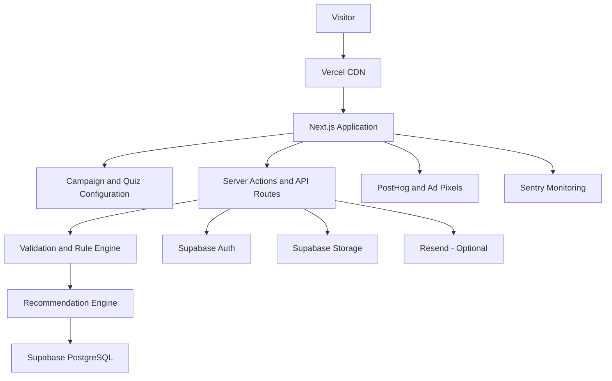

# Gemstone Discovery Platform

## Solution Architecture, MVP Delivery Plan, Technology Stack and Cost Model

**Prepared for:** Client and Development Team  
**Document type:** Client-ready solution architecture proposal  
**Version:** 1.0  
**Date:** September 2026

---

## 1. Executive Summary

The proposed product is a mobile-first gemstone discovery platform that converts visitors from advertisements, social media, influencers, WhatsApp links, and organic search into qualified leads.

Visitors complete a configurable quiz, provide information such as their date of birth or preferences, receive a deterministic gemstone recommendation, and may submit their contact details. The client can then measure which campaigns, advertisements, and quiz journeys generate engagement and leads.

The recommended first release is deliberately smaller than a complete gemstone e-commerce platform. It validates the customer journey before the client invests in payments, inventory, courier integrations, AI-generated advice, 3D visualization, or augmented reality.

The MVP should use programmed and versioned gemstone rules rather than live AI. This gives the client predictable results, faster delivery, almost no AI operating cost, and a safer foundation for future commerce.

### Recommended outcome

- Launch a production-ready mobile quiz funnel.
- Support several campaigns without rebuilding the application.
- Calculate birthstone and zodiac results reliably on the server.
- Present approved gemstone recommendations.
- Capture leads and marketing attribution.
- Give administrators a secure lead-management view.
- Measure conversion before expanding into e-commerce.
- Preserve a data model that can support products, variants, physical stones, jewelry, payments, and fulfilment later.

---

## 2. The Business Problem

### 2.1 The client needs an interactive acquisition experience

Traditional product pages do not create the same level of interaction and personalization as a guided gemstone discovery experience. The client needs a more engaging path from advertisement to recommendation and lead.

### 2.2 Campaign performance is difficult to attribute

Visitors may arrive from Instagram, Facebook, TikTok, influencers, WhatsApp, SEO, or direct links. Without consistent campaign tracking, the client cannot reliably determine which source, advertisement, creative, or landing-page angle generates results.

### 2.3 Gemstone recommendations must be consistent

Birthstone, zodiac, and future preference-based recommendations should come from approved rules and content. Results must not change unpredictably or depend on an AI model inventing associations.

### 2.4 Building commerce immediately creates unnecessary risk

A complete commerce platform introduces:

- Product and variant management
- Individual gemstone records
- Certification data
- Stock and reservations
- Jewelry compatibility
- Cart and checkout
- Online payments and Cash on Delivery
- Courier integrations
- Orders, returns, and refunds
- Financial reconciliation
- More personal and transactional data

The client has not yet validated whether the discovery journey converts visitors into leads or buyers. Building the entire commerce stack first would increase cost and delay learning.

### 2.5 Campaigns should not be hardcoded

The client may want several entry angles, such as:

- Find Your Birthstone
- Discover Your Zodiac Gemstone
- Find a Gemstone for Your Intention
- Find a Gemstone Gift
- Discover Your Gemstone Style

Creating separate code for every campaign would be slow and expensive. The platform needs one configurable quiz engine that can serve multiple campaigns.

---

## 3. Proposed Solution

Build a configurable, mobile-first gemstone discovery platform with the following user journey:

1. A visitor arrives from an advertisement, social post, influencer, WhatsApp link, or search result.
2. The platform captures the campaign and UTM context.
3. The visitor sees a landing page matching the campaign angle.
4. The visitor starts a configurable quiz.
5. Questions and conditional branches are loaded from configuration.
6. The server validates the answers.
7. The server calculates the birthstone, zodiac sign, or rule-based result.
8. The recommendation engine selects approved gemstone IDs.
9. The result page displays approved gemstone content and images.
10. The visitor submits contact details and consent.
11. The platform stores the lead together with the quiz session and campaign attribution.
12. Analytics records funnel completion and abandonment.
13. An administrator reviews and exports the leads.

### Product principle

> Deterministic code decides. The database supplies approved truth. The frontend presents the experience. AI, when introduced later, explains the result but does not control critical calculations, product facts, pricing, stock, or certification.

---

## 4. Scope Definition

### 4.1 MVP scope

- Mobile-first public web application
- Configurable campaign landing pages
- UTM and referral tracking
- Reusable quiz engine
- Conditional quiz questions
- Client-side and server-side validation
- Quiz session persistence
- Birthstone calculation
- Zodiac calculation
- Versioned recommendation rules
- Approved gemstone result content
- Lead-capture form and consent
- Duplicate-submission protection
- Secure administrator login
- Admin lead list and detail view
- CSV export
- Funnel analytics
- Meta Pixel support
- Optional TikTok Pixel support
- Error monitoring
- Abuse prevention and rate limiting
- Production deployment
- Documentation and handover

### 4.2 Optional MVP extensions

- Transactional email containing the result
- Resume quiz using a session link
- Basic content-management interface for campaigns and rules
- Webhook export to a CRM or spreadsheet
- Multi-brand theme configuration

### 4.3 Future versions

- AI-personalized result wording
- WhatsApp result delivery
- Preference and intention-based recommendation logic
- Gemstone catalog
- Product and variant catalog
- Individual physical-stone records
- Certification and document storage
- Jewelry compatibility rules
- Approved combination imagery
- Shopping cart and checkout
- Online payment and Cash on Delivery
- Courier and fulfilment integration
- Returns and refund workflows
- CRM and customer lifecycle management
- Customer accounts and order history
- Multi-language experience
- 3D or augmented-reality experiences after commercial validation

### 4.4 Explicit exclusions from the MVP

- Live AI recommendation decisions
- Payment gateway
- Cash on Delivery processing
- Shopping cart
- Order management
- Courier API
- Inventory and reservations
- Serialized individual gemstone stock
- AI-generated product images
- Real-time gemstone configurator
- 3D visualization
- AR virtual try-on
- RAG or vector database
- Complex CRM
- Native mobile application
- Kubernetes or microservices

---

## 5. Recommended System Architecture



### Architecture style

The MVP should be implemented as a **modular monolith** in one Next.js repository. This application is not complex enough to justify a separate frontend, backend, message broker, or microservice architecture.

Next.js will provide:

- Public pages
- Server-rendered campaign pages
- Quiz interface
- Server Actions
- API routes where external access is required
- Admin interface
- Server-side calculations

Supabase will provide:

- PostgreSQL database
- Administrator authentication
- Row Level Security
- Image and file storage
- Database backups on the production plan

This structure minimizes cost and operational complexity while remaining extensible.

---

## 6. Recommended Technology Stack

| Layer | Technology | Purpose |
|---|---|---|
| Application framework | Next.js App Router | Public pages, server rendering, backend routes, and admin application |
| Programming language | TypeScript | End-to-end type safety |
| UI | React | Interactive quiz and admin components |
| Styling | Tailwind CSS | Responsive mobile-first design |
| Component system | shadcn/ui | Accessible and reusable interface components |
| Form management | React Hook Form | Quiz and lead form state |
| Schema validation | Zod | Shared browser and server validation |
| Database | PostgreSQL through Supabase | Campaigns, sessions, answers, rules, leads, and events |
| Authentication | Supabase Auth | Secure administrator access |
| Storage | Supabase Storage | Approved gemstone and campaign assets |
| Hosting | Vercel Pro | Deployment, CDN, server functions, logs, and rollback |
| Analytics | PostHog | Funnel, event, and abandonment analysis |
| Ad attribution | Meta Pixel and optional TikTok Pixel | Advertising conversion measurement |
| Error monitoring | Sentry | Frontend and server error reporting |
| Transactional email | Resend | Optional result and lead notifications |
| CAPTCHA | Cloudflare Turnstile | Abuse and bot protection |
| Source control | GitHub | Repository, pull requests, issues, and handover |
| CI/CD | GitHub Actions and Vercel | Automated quality checks and deployment |
| Unit tests | Vitest | Calculation, validation, and rule tests |
| Component tests | React Testing Library | Quiz and form component behaviour |
| End-to-end tests | Playwright | Complete user journey testing |
| Database migrations | Supabase CLI | Version-controlled schema changes |
| Development assistant | Claude CLI | Specification-assisted implementation and review |

### Why this stack is recommended

- One primary language across frontend and backend
- Small number of infrastructure providers
- Fast development and deployment
- Strong support for mobile performance and SEO
- Managed database, authentication, storage, and backups
- Easy GitHub handover
- Low MVP operating cost
- Clear upgrade path to future commerce

---

## 7. Application Modules

```text
gemstone-discovery-platform/
├── app/
│   ├── page.tsx
│   ├── campaigns/[slug]/page.tsx
│   ├── quiz/[sessionId]/page.tsx
│   ├── result/[sessionId]/page.tsx
│   ├── admin/
│   │   ├── login/page.tsx
│   │   ├── leads/page.tsx
│   │   ├── campaigns/page.tsx
│   │   └── rules/page.tsx
│   └── api/
├── components/
│   ├── landing/
│   ├── quiz/
│   ├── results/
│   ├── forms/
│   └── ui/
├── lib/
│   ├── calculations/
│   ├── recommendations/
│   ├── validation/
│   ├── analytics/
│   ├── auth/
│   └── services/
├── config/
├── supabase/
│   ├── migrations/
│   └── seed.sql
├── specs/
├── tests/
│   ├── unit/
│   ├── integration/
│   └── e2e/
└── docs/
```

### Main modules

#### Campaign module

- Campaign slug and status
- Entry angle
- Landing-page content
- Quiz configuration
- Result template
- CTA and disclaimer
- Tracking metadata

#### Quiz module

- Configurable questions
- Required and optional fields
- Conditional branching
- Progress tracking
- Client and server validation
- Session persistence

#### Calculation module

- Date validation
- Birth-month extraction
- Birthstone mapping
- Zodiac boundary calculation
- Leap-year tests
- Rule versioning

#### Recommendation module

- Entry-angle selection
- Approved rule matching
- Gemstone ID selection
- Approved content retrieval
- Structured result response

#### Lead module

- Contact and consent capture
- Session association
- Campaign attribution
- Duplicate protection
- Administrator review
- Export

#### Analytics module

- Landing-page view
- Quiz start
- Question completion
- Validation error
- Quiz abandonment
- Result view
- Lead submission
- Campaign and creative attribution

---

## 8. Data Model

### MVP tables

| Table | Purpose | Important fields |
|---|---|---|
| `campaigns` | Campaign entry angles and presentation | `id`, `slug`, `entry_angle`, `quiz_config_id`, `status` |
| `quiz_configs` | Reusable quiz definitions | `id`, `name`, `version`, `status` |
| `quiz_questions` | Question schema | `id`, `type`, `label`, `required`, `used_for`, `validation` |
| `quiz_config_questions` | Ordered question membership | `quiz_config_id`, `question_id`, `position`, `condition` |
| `quiz_sessions` | One record per quiz journey | `id`, `campaign_id`, `utm`, `status`, `started_at`, `completed_at` |
| `quiz_answers` | Validated answers | `id`, `session_id`, `question_id`, `value` |
| `recommendation_rules` | Versioned rules mapping answers to gemstone IDs | `id`, `entry_angle`, `match`, `gemstone_ids`, `version` |
| `gemstones` | Approved gemstone types and display content | `id`, `name`, `description`, `image_path`, `status` |
| `recommendation_results` | Reproducible calculated result | `id`, `session_id`, `rule_version`, `result_payload` |
| `leads` | Contact and consent information | `id`, `session_id`, `name`, `email`, `phone`, `consent`, `created_at` |
| `analytics_events` | Server-validated funnel events | `id`, `session_id`, `event_type`, `payload`, `created_at` |
| `audit_logs` | Important administrator changes | `id`, `actor_id`, `action`, `entity_type`, `entity_id`, `created_at` |

### Important database decisions

- Use stable IDs rather than display names.
- Store the rule version used for every recommendation.
- Keep quiz sessions separate from leads.
- Keep gemstone types separate from future sellable products.
- Collect only the personal information required for the business purpose.
- Use Supabase Auth rather than a custom password table.
- Use Row Level Security for administrative data.

### Future commerce hierarchy


The MVP stores gemstone types only. Commerce tables should be added when catalog and fulfilment requirements are confirmed.

---

## 9. API and Service Requirements

### Required services

| Service | Required for MVP? | Purpose | Expected initial plan |
|---|---:|---|---|
| Vercel | Yes | Application hosting and deployment | Pro |
| Supabase | Yes | PostgreSQL, admin authentication, storage, backups | Pro |
| GitHub | Yes | Source control and delivery workflow | Free or existing organization |
| PostHog | Recommended | Funnel and product analytics | Free tier initially |
| Sentry | Recommended | Error monitoring | Developer or Team |
| Cloudflare Turnstile | Recommended | Bot protection | Free |
| Meta Pixel | Recommended | Meta campaign attribution | Free |
| TikTok Pixel | Optional | TikTok campaign attribution | Free |
| Resend | Optional | Result and notification emails | Free initially |

### No live AI API is required for the MVP

The initial release should not call Claude, DeepSeek, Qwen, OpenAI, or another LLM during the customer journey. Approved templates are faster, less expensive, and more reliable.

### Future AI integration

If personalized explanation is validated as valuable, introduce a provider-independent AI service:

```typescript
interface ExplanationProvider {
  createExplanation(input: {
    gemstoneId: string;
    approvedFacts: string[];
    campaignAngle: string;
    locale: string;
  }): Promise<{
    text: string;
    model: string;
    promptVersion: string;
  }>;
}
```

The AI receives the already-selected gemstone ID and approved facts. It may improve wording but may not change the recommendation, invent properties, or create medical claims.

---

## 10. Security, Privacy and Content Safety

### Security controls

- Supabase Auth for administrator login
- Server-only service credentials
- Row Level Security
- Zod validation on every write
- Rate limiting on session, lead, and event endpoints
- Turnstile on lead submission if abuse appears
- Secure and HTTP-only session cookies
- Content Security Policy
- Input length and file restrictions
- Idempotency for duplicate submissions
- Audit logs for important admin changes
- Production backups
- Dependency and secret scanning
- No secrets in browser bundles or repository history

### Personal-data considerations

Date of birth and contact information are personal data. The platform should:

- Collect only what is necessary.
- Consider collecting month and day instead of full year if age is not required.
- Explain why the information is collected.
- Record consent where needed.
- Define a retention period.
- Provide deletion procedures.
- Decide whether users under 18 are allowed.
- Keep analytics payloads free of unnecessary personal information.

### Gemstone and belief-related content

All gemstone mappings and descriptions require client approval. The platform should avoid unapproved medical, financial, religious, or guaranteed-outcome claims.

Preferred language includes:

- Traditionally associated with
- Symbolically connected to
- Commonly regarded as
- In this recommendation system

Avoid claims such as:

- Cures anxiety
- Guarantees wealth
- Prevents illness
- Required by your religion
- Scientifically proven to change destiny

---

## 11. Specification-Driven Development with Claude CLI

Claude CLI should be used as a development accelerator inside a controlled engineering workflow. It is not the production recommendation engine.

### Specification structure

Every feature specification should include:

- Business objective
- User story
- Included and excluded behaviour
- UI states
- Data model
- Server contracts
- Validation rules
- Permission rules
- Analytics events
- Failure states
- Security considerations
- Acceptance criteria
- Unit, integration, and end-to-end tests
- Rollback notes

### Recommended specification sequence

1. Architecture decisions and repository standards
2. Database schema and access policies
3. Campaign configuration
4. Landing-page rendering
5. Quiz question schema
6. Quiz session lifecycle
7. Conditional branching
8. Date validation
9. Birthstone calculation
10. Zodiac calculation
11. Recommendation rules
12. Result page
13. Lead capture and consent
14. Analytics events
15. Admin authentication
16. Admin lead management
17. Export
18. Monitoring and deployment

### Development workflow

1. Approve the specification.
2. Ask Claude CLI to inspect the repository and propose a technical plan.
3. Confirm assumptions before implementation.
4. Implement one bounded feature.
5. Add or update tests.
6. Run formatting, linting, type checking, and tests.
7. Review security-sensitive code manually.
8. Review database migrations before application.
9. Test failure and edge cases.
10. Commit a small, reversible change.
11. Update documentation.
12. Demonstrate acceptance criteria before closing the feature.

### Required quality commands

```bash
npm run format:check
npm run lint
npm run typecheck
npm run test
npm run test:e2e
npm run build
```

Claude CLI can accelerate implementation, but architecture, rule accuracy, production security, analytics verification, and deployment still require human ownership.

---

## 12. Development Tools

| Tool | Purpose |
|---|---|
| Claude CLI | Plan, implement, test, refactor, and document bounded specifications |
| VS Code | Primary code editor |
| GitHub | Repository, code review, issues, and client handover |
| GitHub Projects | Backlog, sprint, and acceptance tracking |
| GitHub Actions | Automated checks on pull requests |
| Figma | Approved mobile and desktop designs |
| Supabase CLI | Local database, migrations, seed data, and type generation |
| Vercel CLI | Preview and production deployment |
| Postman or Bruno | API and webhook testing |
| Playwright | Cross-browser and mobile-flow testing |
| Vitest | Calculation and validation testing |
| Lighthouse | Performance, SEO, and accessibility verification |
| Sentry | Error monitoring |
| PostHog | Product and funnel analytics |

### Accounts the client should own

- GitHub organization and repository
- Vercel team and production project
- Supabase organization and production project
- Domain and DNS account
- Analytics account
- Meta and TikTok advertising accounts
- Resend account if email is enabled
- Sentry account

The developer should receive role-based access. The client should never depend on the developer's personal accounts after handover.

---

## 13. Delivery Plan and Timeline

### Phase 0: Decisions and specification - 1 week

- Confirm exact MVP scope.
- Confirm campaign entry angles.
- Approve questions and lead fields.
- Approve birthstone and zodiac rule sources.
- Approve content and disclaimer ownership.
- Confirm whether full date of birth is necessary.
- Confirm analytics and advertising platforms.
- Approve architecture and acceptance criteria.

### Phase 1: Foundation - 1 week

- Repository and development standards
- Next.js application
- Design system
- Supabase environments
- Initial schema and migrations
- CI/CD
- Error and loading foundations

### Phase 2: Campaign and quiz engine - 1.5 to 2 weeks

- Configurable campaigns
- UTM capture
- Quiz schema
- Question renderer
- Conditional branching
- Session lifecycle
- Client and server validation

### Phase 3: Calculations and recommendations - 1.5 weeks

- Date validation
- Birthstone rules
- Zodiac boundary logic
- Versioned recommendation rules
- Approved gemstone content
- Result page
- Complete calculation test matrix

### Phase 4: Lead capture, admin and analytics - 1.5 to 2 weeks

- Lead form and consent
- Duplicate protection
- Secure admin access
- Lead list and detail view
- CSV export
- PostHog events
- Meta Pixel and optional TikTok Pixel
- Optional email notification

### Phase 5: QA, optimization and launch - 1.5 to 2 weeks

- End-to-end testing
- Mobile device testing
- Accessibility review
- Security review
- Analytics validation
- Performance optimization
- Production migration
- Backup verification
- Deployment and smoke tests
- Documentation and handover

### Realistic total duration

| Delivery setup | Estimated duration |
|---|---:|
| One experienced full-stack developer using Claude CLI | 7-10 weeks |
| Two experienced developers | 5-7 weeks |
| Beginner developer using Claude CLI | 12-18 weeks |
| MVP plus custom content-management screens | Add 1-2 weeks |
| MVP plus email and CRM webhook | Add 3-5 working days |

The recommended client commitment is **8-10 weeks**, assuming approved designs and content are available and feedback is returned promptly.

### Why Claude CLI does not reduce this to two weeks

Claude CLI can accelerate component development, calculations, tests, database migrations, and documentation. It does not remove the need for:

- Product decisions
- Content approval
- Correct gemstone mappings
- Design review
- Mobile QA
- Analytics verification
- Security review
- Production access and deployment
- Client acceptance

---

## 14. Testing Strategy

### Unit tests

- Every birth month
- Every zodiac sign
- Every zodiac boundary date
- Leap years
- Invalid and future dates
- Missing answers
- Rule version selection
- Recommendation output
- Validation schemas

### Integration tests

- Campaign configuration loading
- Quiz session creation
- Answer persistence
- Server-side calculation
- Recommendation result persistence
- Lead creation
- Duplicate submission
- Authentication and permissions
- Analytics event validation
- Database migrations

### End-to-end tests

- Advertisement-style URL to landing page
- UTM persistence
- Full birthstone quiz
- Full zodiac quiz
- Back and continue behaviour
- Page refresh during quiz
- Result reload
- Lead submission
- Admin login
- Lead review and export

### Non-functional tests

- Mobile Safari
- Mobile Chrome
- Desktop Chrome, Safari, Firefox, and Edge
- Keyboard navigation
- Labels and screen readers
- Color contrast
- Slow connection
- Image optimization
- Rate limiting
- Invalid payloads
- Production analytics

---

## 15. MVP Acceptance Criteria

The MVP is accepted when:

- Campaign landing pages work on supported mobile and desktop browsers.
- UTM and campaign context persist through the quiz.
- Quiz questions render from configuration.
- Conditional branches behave according to the approved specification.
- Required fields validate on both client and server.
- Invalid, missing, and future dates are rejected.
- Birthstones are calculated on the server.
- Zodiac signs are calculated on the server.
- Every approved boundary-date test passes.
- Recommendation results are deterministic and versioned.
- Only approved gemstone content is displayed.
- Results remain available after page refresh.
- Lead data is stored with session and campaign attribution.
- Duplicate submissions are handled safely.
- Consent information is retained as specified.
- Administrator access is protected.
- Leads can be reviewed and exported.
- Analytics events fire with the approved properties.
- No secrets appear in browser code or repository history.
- Production monitoring and backups are enabled.
- Lint, type checks, automated tests, and production build pass.
- No payment, inventory, or live AI functionality is present in the MVP.

---

## 16. Estimated Development Cost

### Suggested one-time pricing

| Delivery | Estimated price |
|---|---:|
| Clickable design prototype | $1,500-$3,000 |
| Technical proof of concept | $4,000-$7,000 |
| Defined production MVP | $12,000-$22,000 |
| MVP with polished CMS and additional integrations | $18,000-$28,000 |
| Commerce version with catalog, inventory, checkout, and fulfilment | Separate discovery; typically $30,000-$60,000+ |

### Recommended client proposal

> **$16,000-$20,000 for the defined production MVP, delivered in approximately 8-10 weeks.**

This should include architecture, implementation, responsive interface, Supabase setup, analytics, tests, production deployment, documentation, and handover.

The following should be separately estimated:

- New quiz categories beyond the agreed set
- Full content-management system
- WhatsApp integration
- CRM integration
- Multi-language support
- AI personalization
- Payment and Cash on Delivery
- Inventory and certification
- Jewelry compatibility and commerce
- 3D or augmented reality

---

## 17. Monthly Operating Cost After Handover

### Recommended production setup

| Service | Expected monthly cost | Notes |
|---|---:|---|
| Vercel Pro | $20 | Includes usage credit; additional usage depends on traffic |
| Supabase Pro | $25 | Includes one Micro project, daily backups, and production quotas |
| PostHog | $0 initially | Free allowance normally covers early MVP traffic |
| Sentry | $0-$26 | Developer plan for one user or Team plan for multiple users |
| Resend | $0 initially | Up to 3,000 emails monthly on the published free plan |
| Domain | Approximately $1-$3 averaged monthly | Normally billed annually |
| Turnstile | $0 | Bot protection |
| Meta/TikTok Pixel | $0 | Advertising spend is separate |
| **Expected total** | **Approximately $46-$94 per month** | Before unusual traffic or paid support |

Current public starting prices used for planning:

- [Vercel pricing](https://vercel.com/pricing)
- [Supabase pricing](https://supabase.com/pricing)
- [Resend pricing](https://resend.com/pricing)
- [Sentry pricing](https://sentry.io/pricing/)
- [PostHog pricing](https://posthog.com/pricing)

### Practical budget to communicate

Allow **$75-$150 per month** for normal early production operation. This gives room for email, monitoring, traffic overages, backups, and small provider changes.

Advertising spend, content creation, legal review, payment fees, SMS, WhatsApp, and future AI usage are not included.

### Important distinction

Claude CLI is a development tool. Its subscription or usage is part of the developer's delivery cost and is not required for the application to operate after handover.

The MVP has no production AI API cost.

---

## 18. Maintenance and Support Pricing

If the client receives complete ownership, ongoing support can be optional.

### Suggested packages

| Package | Monthly fee | Included |
|---|---:|---|
| Handover only | $0 recurring | Client pays providers directly; fixes billed when requested |
| Essential care | $400-$600 | Monitoring review, updates, backups, and critical fixes |
| Managed product | $750-$1,250 | Essential care plus analytics review and minor improvements |
| Continuous development | $2,000-$4,000 | Ongoing roadmap work and reserved development capacity |

### Recommended offer

> **$750 per month for managed support, plus third-party platform costs paid directly by the client.**

Suggested inclusions:

- Monthly health check
- Dependency and security updates
- Monitoring review
- Backup confirmation
- Critical bug fixes
- Analytics and conversion summary
- Up to five hours of minor changes or support
- Response within the agreed support window

Additional work can be billed at the agreed hourly or daily rate.

### One-time handover fee

If the client does not want a maintenance agreement, charge approximately **$1,000-$2,000** for:

- Account transfer and permission review
- Production environment documentation
- Administrator training
- Developer handover session
- Deployment demonstration
- Backup and recovery explanation
- Final access and ownership checklist

---

## 19. Risks and Mitigations

| Risk | Impact | Mitigation |
|---|---|---|
| MVP expands into commerce during development | High | Signed scope, change control, and future backlog |
| Incorrect birthstone mapping | Medium | Approved source, versioned rules, and monthly test matrix |
| Incorrect zodiac boundary | High | Exhaustive boundary-date and leap-year tests |
| Gemstone claims create legal or reputational risk | High | Approved wording, disclaimers, and specialist review |
| Full date of birth is collected unnecessarily | Medium | Data-minimization review before coding |
| Poor mobile experience | High | Mobile-first design, device testing, and performance budget |
| Campaign attribution is lost | Medium | UTM persistence, server-linked sessions, and production event QA |
| Duplicate or spam leads | Medium | Idempotency, rate limits, and optional Turnstile |
| Admin data is exposed | High | Supabase Auth, RLS, secure server code, and permission tests |
| Provider lock-in | Medium | Exportable PostgreSQL data and isolated service adapters |
| AI is introduced too early | Medium | Explicit MVP boundary and deterministic recommendation rules |
| Client accounts remain developer-owned | High | Client-owned account policy before production |

---

## 20. Success Metrics

### Funnel metrics

- Landing-page views
- Quiz-start rate
- Completion rate
- Abandonment by question
- Result-view rate
- Lead-submission rate
- Cost per completed quiz
- Cost per lead

### Campaign metrics

- Conversion by source
- Conversion by campaign
- Conversion by creative
- Conversion by entry angle
- Conversion by device

### Product quality metrics

- Validation-error rate
- Calculation-error rate
- Duplicate-lead rate
- Page-load performance
- JavaScript and server errors
- Analytics-event delivery rate

### Business metrics

- Contacted leads
- Qualified leads
- Appointments or consultations
- Purchases attributed to the funnel
- Revenue per campaign

The client should use these metrics to decide whether to fund AI personalization, catalog, and commerce phases.

---

## 21. Client Responsibilities

The client should provide or approve:

- Brand identity and design direction
- Initial campaign angles
- Landing-page copy
- Quiz questions
- Required and optional lead fields
- Birthstone mappings
- Zodiac mappings
- Recommendation rules
- Gemstone descriptions and images
- Disclaimers
- Privacy and consent wording
- Under-18 policy
- Advertising accounts and tracking IDs
- Domain and DNS access
- Named product owner
- Named content and rule approver
- Timely acceptance feedback

Delays in content, rule approval, designs, access, or feedback will affect the delivery schedule.

---

## 22. Handover Deliverables

The final handover should include:

- Complete GitHub repository
- Client-owned Vercel project
- Client-owned Supabase project
- Production domain configuration
- Source code and commit history
- Database migrations and seed data
- Environment-variable template without secrets
- Architecture documentation
- Data-model documentation
- API and server-action documentation
- Campaign and quiz configuration guide
- Birthstone and zodiac rule documentation
- Analytics event dictionary
- Administrator guide
- Deployment and rollback instructions
- Backup and recovery instructions
- Automated test suite
- Test-running instructions
- Known limitations
- Future roadmap
- Access and ownership checklist
- Recorded or live technical handover session

---

## 23. Recommended Build Decision

Proceed with the deterministic gemstone discovery MVP.

Recommended implementation:

- Next.js modular monolith
- TypeScript throughout
- Tailwind CSS and shadcn/ui
- Supabase PostgreSQL, Auth, and Storage
- Vercel hosting
- PostHog analytics
- Sentry monitoring
- Resend only if email delivery is required
- Claude CLI for specification-driven development
- No live AI, payment, inventory, or courier integration in the MVP

Recommended delivery commitment:

> **8-10 weeks and $16,000-$20,000 for a production MVP.**

Recommended client operating budget after handover:

> **$75-$150 per month for platform services**, excluding advertising and optional support.

Recommended support offer:

> **$750 per month plus direct third-party costs**, or a one-time $1,000-$2,000 handover package with no recurring development obligation.

The discovery funnel should be launched, measured, and improved before the client commits to AI personalization or a full gemstone commerce platform.

---

## Appendix A: Architecture Decisions Required Before Coding

### Must decide before development

- Final MVP scope
- Next.js App Router
- TypeScript requirement
- Supabase region and production plan
- Vercel ownership and team
- Admin roles
- Lead fields
- Consent wording
- Under-18 policy
- Gemstone rule owner
- Content approval process
- Git workflow

### Can decide during development

- Exact campaign configuration storage format
- PostHog dashboard layout
- Sentry plan
- Image organization
- Optional result email
- Domain structure
- Export format details

### Can postpone

- AI provider
- Payment provider
- Cash on Delivery provider
- Courier provider
- WhatsApp provider
- CRM
- Product catalog
- Inventory model implementation
- 3D and AR tooling
- Native mobile application

## Appendix B: First Development Milestone

The first milestone should demonstrate one complete thin slice:

1. Open a campaign landing page.
2. Capture UTM parameters.
3. Start a quiz session.
4. Answer a date-of-birth question.
5. Validate the date on the server.
6. Calculate one approved birthstone result.
7. Display approved gemstone content.
8. Submit a lead.
9. View the lead in the secure admin area.
10. Confirm the funnel events in analytics.

Completing this thin slice early validates the full architecture before additional quiz paths and content are added.
