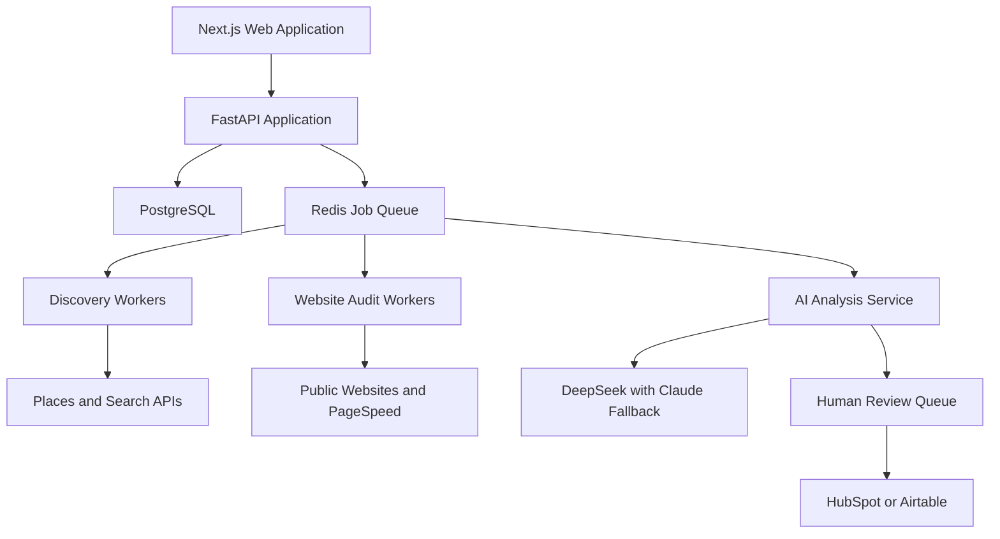
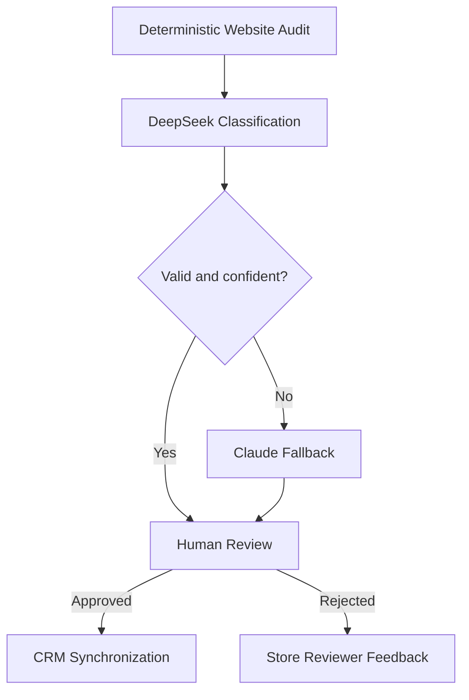

# Lead Discovery Radar

## AI-Powered Lead Discovery and Business Intelligence Platform

**Solution Architecture and Delivery Proposal**  
**Prepared for:** Flex The Brand Studio  
**Document status:** Client-ready technical proposal  
**Version:** 1.0  
**Date:** September 2026

---

## 1. Executive Summary

Flex The Brand Studio currently depends on external lead marketplaces, advertising platforms, and manual prospect research. These channels are becoming more expensive, less predictable, and increasingly difficult to scale. At the same time, useful business information is spread across search results, business directories, company websites, and internal sales systems.

We propose building **Lead Discovery Radar**, an internal AI-assisted lead discovery and business intelligence platform. The platform will discover relevant businesses from permitted data sources, analyse their public websites, identify evidence-backed digital opportunities, remove duplicates, and place qualified records into a human review workflow before approved leads are synchronized with the CRM.

The product will not be an unrestricted social-media scraper and will not automatically contact prospects. It will be a controlled, auditable workflow that combines reliable software rules, focused AI analysis, and mandatory human approval.

### Expected outcome

- Reduce time spent on repetitive prospect research.
- Build a repeatable and measurable lead discovery process.
- Give sales representatives structured, evidence-backed lead information.
- Improve lead consistency and CRM data quality.
- Control AI and data-provider costs through model routing and usage limits.
- Preserve human decision-making before any lead enters the active sales workflow.

---

## 2. The Problem

### 2.1 Declining performance from existing channels

Lead marketplaces and paid advertising channels such as Bark, Thumbtack, and Meta Ads can become more expensive while producing inconsistent lead quality. The agency has limited control over the data, competition, timing, and qualification process on these platforms.

### 2.2 Manual prospect research

Finding suitable businesses currently requires people to search directories, review websites, identify possible service gaps, collect contact information, and manually transfer records into a CRM. This work is slow, inconsistent, and difficult to measure.

### 2.3 Unstructured and unverified data

Potential leads can arrive without consistent industry classifications, evidence, sources, confidence levels, or duplicate checks. This creates additional work for sales representatives and makes it difficult to understand why a business was considered relevant.

### 2.4 Compliance and platform-access constraints

Automated access to LinkedIn, Instagram, Facebook, TikTok, X, and other gated platforms is restricted, unreliable, or commercially risky. A sustainable solution must use official APIs, licensed services, and permitted public website access.

### 2.5 No scalable internal discovery system

The business needs an internal capability that can discover and process opportunities repeatedly across industries and geographical markets without rebuilding the workflow for every campaign.

---

## 3. Proposed Solution

Lead Discovery Radar will provide a controlled pipeline from business discovery to CRM-ready lead.

1. A user creates a search job and selects geography, industry, and discovery sources.
2. The platform retrieves business information through permitted APIs.
3. Source records are stored with timestamps and provenance.
4. Business names, domains, addresses, and phone numbers are normalized.
5. Duplicate records are identified and resolved.
6. Public business websites are audited using deterministic checks.
7. AI classifies the business and proposes evidence-backed service opportunities.
8. A human reviewer approves, edits, rejects, or requests more information.
9. Only approved leads are synchronized with the CRM.
10. Outcomes and reviewer corrections are retained for reporting and future improvement.

### Core product principle

The system assists salespeople; it does not replace them. AI recommendations rank attention and provide context, but they do not make final qualification or outreach decisions.

---

## 4. Product Scope

### 4.1 MVP scope

- Secure user login and role-based access
- Search-job creation by industry and geography
- Google Places business discovery
- Brave Search supplementary discovery
- Raw-source storage and provenance
- Business-data normalization
- Duplicate detection and entity resolution
- Public website discovery and controlled fetching
- PageSpeed and technical website auditing
- AI business classification
- AI opportunity suggestions with evidence and confidence
- Lead scoring using transparent components
- Human review queue
- Approve, reject, edit, duplicate, enrich, and do-not-contact actions
- HubSpot or Airtable export and synchronization
- Suppression list and opt-out handling
- Job retries, error logs, cost tracking, and basic monitoring

### 4.2 Future scope

- Additional licensed discovery sources
- Contact enrichment through Apollo, Hunter, or a comparable provider
- Email deliverability verification
- Launch-event and business-expansion detection
- AI-assisted personalized email drafts
- Advanced reporting and conversion feedback
- Additional CRM integrations
- Multi-tenant SaaS functionality
- Self-hosted AI models at higher processing volume

### 4.3 Explicitly excluded from the MVP

- LinkedIn, Meta, TikTok, X, or Reddit scraping
- Private-profile access
- CAPTCHA or anti-bot bypassing
- Automated cold-email or direct-message sending
- Autonomous qualification without human review
- Guaranteed buying-intent detection
- Building a complete internal CRM
- Nationwide business-registration aggregation

---

## 5. Recommended Architecture



### Architecture approach

The MVP should be implemented as a **modular monolith**. The web application, API, shared business logic, and workers may live in one repository while remaining separated into clear modules. This is faster to develop, test, deploy, and maintain than an early microservice architecture.

Discovery, website auditing, AI processing, and CRM synchronization run as background jobs. This prevents slow external operations from blocking the user interface and allows failed jobs to be retried safely.

Individual workers can be separated into independent services later if usage or team size requires it.

---

## 6. Recommended Technology Stack

| Layer | Recommended technology | Responsibility |
|---|---|---|
| Frontend | Next.js and TypeScript | Internal browser-based application |
| UI system | Tailwind CSS and shadcn/ui | Accessible and consistent interface |
| Backend | Python and FastAPI | APIs, workflows, integrations, and business logic |
| Validation | Pydantic | Strict request, database, and AI-output schemas |
| Database | PostgreSQL | Primary system of record |
| Search and matching | PostgreSQL JSONB, `pg_trgm`, optional vector extension | Flexible payload storage and duplicate matching |
| Authentication | Supabase Auth | Login, invitations, password reset, and sessions |
| Authorization | Application role-based access control | Admin, reviewer, sales, and technical roles |
| Background jobs | Redis with Dramatiq or Celery | Discovery, audit, AI, and CRM jobs |
| Static website retrieval | HTTPX and BeautifulSoup/lxml | Fast, controlled public-page processing |
| Browser fallback | Playwright | JavaScript-rendered websites where permitted |
| Primary AI model | DeepSeek Flash | Low-cost classification and extraction |
| AI fallback | Claude Sonnet | Difficult, uncertain, or invalid cases |
| Object storage | Cloudflare R2 or S3 | Raw artifacts, exports, and optional screenshots |
| CRM | HubSpot API | Approved-lead synchronization |
| Error monitoring | Sentry | Application and worker errors |
| Product analytics | PostHog | Workflow and feature usage |
| Availability monitoring | UptimeRobot or equivalent | Health and uptime alerts |
| Deployment | Docker and GitHub Actions | Reproducible environments and automated deployment |
| Runtime hosting | DigitalOcean or Hetzner | API, frontend, Redis, and worker processes |
| Managed data platform | Supabase Pro | PostgreSQL, authentication, and backups |

### Suggested repository structure

```text
lead-discovery-radar/
├── apps/
│   ├── web/                  # Next.js frontend
│   └── api/                  # FastAPI application
├── modules/
│   ├── discovery/
│   ├── website_audit/
│   ├── normalization/
│   ├── deduplication/
│   ├── ai_analysis/
│   ├── review/
│   ├── crm_sync/
│   └── compliance/
├── workers/
│   ├── discovery_worker/
│   ├── audit_worker/
│   ├── ai_worker/
│   └── crm_worker/
├── tests/
├── specs/
├── infrastructure/
└── docker-compose.yml
```

---

## 7. External APIs and Services

### Required for the MVP

| API or service | Purpose |
|---|---|
| Google Places API | Business discovery, category, address, phone, website, status, and coordinates |
| Google PageSpeed Insights API | Performance and Core Web Vitals analysis |
| Brave Search API | Supplementary public-web discovery |
| DeepSeek API | Primary AI classification and structured extraction |
| Claude API | Fallback for difficult or low-confidence records |
| HubSpot or Airtable API | Approved-lead export and synchronization |
| Supabase | PostgreSQL, authentication, and backups |
| Cloudflare R2 or S3 | Artifact and export storage |
| Sentry | Error monitoring and investigation |

### Optional later integrations

- Apollo or Hunter for licensed business contact enrichment
- ZeroBounce or NeverBounce for email verification
- Pipedrive or GoHighLevel CRM adapters
- Additional permitted business directories
- Government registration or licensing feeds where access and commercial use are authorized

### Important implementation rule

Every external integration should be placed behind an adapter interface. Replacing one search provider, model, or CRM must not require rewriting the processing pipeline.

---

## 8. AI Strategy: Features First, Constrained Agent Later

The application should not be designed as one unrestricted autonomous agent. Discovery, normalization, deduplication, scoring, suppression, and CRM synchronization must remain deterministic and testable.

### 8.1 AI features in the MVP

#### Business understanding

- Summarize what the business offers.
- Classify industry and customer type.
- Identify geographic coverage.
- Extract services from public website content.

#### Opportunity analysis

- Suggest potential digital-service gaps.
- Require evidence and a source URL for each suggestion.
- Return `unknown` when sufficient evidence is unavailable.
- Distinguish an observed fact from an inference.

#### Review assistance

- Explain why the lead may be relevant.
- Display confidence and supporting evidence.
- Suggest the most relevant agency service.
- Generate a draft outreach angle after approval.

### 8.2 Recommended AI routing



DeepSeek Flash should process standard records because of its low token cost. Claude should be used only when the first result fails schema validation, has low confidence, or contains conflicting evidence.

### 8.3 Potential constrained research agent

A research agent may be added after the deterministic MVP is validated. The agent may:

- Retrieve an existing normalized business record.
- Read permitted website pages.
- run an approved website audit.
- Search approved public sources.
- Check for possible duplicates.
- Produce structured, evidence-backed analysis.

The agent may not:

- Create CRM records without approval.
- Send emails or direct messages.
- Access restricted platforms.
- Invent contacts, dates, budgets, or buying intent.
- Remove suppression entries.
- Merge or delete businesses automatically.

---

## 9. Data Model

Recommended core entities:

- `users`
- `roles`
- `search_jobs`
- `source_records`
- `businesses`
- `business_sources`
- `website_snapshots`
- `website_audits`
- `opportunities`
- `ai_runs`
- `review_decisions`
- `contacts`
- `crm_sync_jobs`
- `suppression_entries`
- `audit_logs`

Raw source records should remain separate from normalized businesses. This preserves provenance, supports debugging and reprocessing, and prevents third-party payload structures from controlling the main application schema.

Every AI claim should include:

```json
{
  "opportunity_type": "missing_online_booking",
  "recommended_service": "website_optimization",
  "confidence": 0.87,
  "evidence": "No booking or appointment link was found on the audited pages.",
  "source_url": "https://example.com",
  "requires_human_review": true
}
```

---

## 10. Security, Privacy, and Compliance

The platform will process primarily public business information, but it must still be built with appropriate controls.

### Required controls

- Role-based access control
- Secure session handling
- Encrypted connections
- Secrets stored outside source code
- API-key rotation capability
- Server-side request forgery protection for website fetching
- Domain and IP validation
- Request timeouts, redirect limits, and response-size limits
- Per-host rate limiting and caching
- Audit logging for important actions
- Suppression and do-not-contact lists
- Data-retention and deletion procedures
- Backups and recovery testing
- Human approval before CRM export

### AI privacy rules

Only information necessary for classification should be sent to model providers. Private CRM notes, credentials, customer correspondence, and unnecessary personal information should not be included.

Before production use, the client should confirm provider terms, data retention, processing location, training usage, subprocessors, and availability of a suitable data-processing agreement.

### Compliance boundary

The platform can provide engineering controls for provenance, deletion, suppression, and review. Final legal approval for outreach and data-provider use remains the client's responsibility.

---

## 11. Development Method

The application will use **specification-driven development supported by Claude CLI**.

Claude CLI is a development accelerator, not the runtime AI provider. It can assist with implementation, tests, documentation, refactoring, and code review. The production application can use DeepSeek, Claude, Qwen, or another model through a provider-independent interface.

### Feature specification structure

Each feature specification should define:

- Business objective
- User stories
- Functional requirements
- Data-model changes
- API contracts
- Permissions
- Error and retry behaviour
- Security requirements
- Acceptance criteria
- Unit and integration tests
- Definition of done

### Recommended specification sequence

1. Authentication and roles
2. Search jobs
3. Google Places adapter
4. Brave Search adapter
5. Raw-source storage and provenance
6. Normalization
7. Deduplication
8. Website retrieval and audit
9. AI classification
10. Review workflow
11. CRM synchronization
12. Suppression and deletion
13. Monitoring and reporting

Development should proceed in complete vertical slices. Each slice should include interface, backend, database, permissions, tests, logging, and documentation before the next major feature begins.

---

## 12. Development Tools

| Tool | Use |
|---|---|
| Claude CLI | Spec-assisted implementation, refactoring, tests, and documentation |
| GitHub | Source control, issues, pull requests, and client handover |
| GitHub Actions | Automated linting, tests, builds, and deployment |
| Docker | Consistent local, staging, and production environments |
| OpenAPI | Backend API documentation and typed frontend integration |
| Pytest | Backend unit and integration tests |
| Playwright Test | Browser-level end-to-end tests |
| Vitest | Frontend unit tests |
| Ruff and mypy | Python formatting, linting, and type checking |
| ESLint and TypeScript | Frontend quality and type safety |
| Alembic | Database migrations |
| Postman or Bruno | API development and acceptance testing |
| Sentry | Runtime error monitoring |
| PostHog | Product analytics and workflow measurement |

---

## 13. Estimated Delivery Plan

### Phase 0: Source and requirements validation - 1 week

- Confirm target industries and geographies.
- Validate Google Places and Brave access.
- Confirm permitted fields and storage rules.
- Select HubSpot or Airtable.
- Finalize acceptance criteria and usage assumptions.

### Phase 1: Platform foundation - 2 weeks

- Repository and environments
- Authentication and roles
- PostgreSQL schema
- Search-job interface
- Background queue
- Logging and error foundation

### Phase 2: Discovery pipeline - 2 weeks

- Google Places adapter
- Brave Search adapter
- Raw payload storage
- Provenance and rate limiting
- Search-job status and retries

### Phase 3: Processing and website audit - 2 to 3 weeks

- Normalization
- Duplicate detection
- Website discovery
- Controlled website retrieval
- Deterministic audit checks
- PageSpeed integration

### Phase 4: AI intelligence - 2 weeks

- DeepSeek integration
- Claude fallback
- Structured-output validation
- Evidence and confidence model
- Cost and token tracking
- Prompt-version tracking

### Phase 5: Review and CRM - 2 to 3 weeks

- Reviewer workspace
- Approve, reject, edit, duplicate, and do-not-contact actions
- CRM field mapping
- Duplicate checking against CRM
- Retryable synchronization
- Sync history

### Phase 6: Production hardening and handover - 2 to 3 weeks

- Security testing
- End-to-end testing
- Monitoring and alerts
- Backups and recovery
- Retention and deletion workflows
- Deployment documentation
- User training and technical handover

### Overall estimate

| Team structure | Expected delivery time |
|---|---:|
| One experienced full-stack engineer using Claude CLI | 14-18 weeks |
| Two experienced engineers | 10-13 weeks |
| Production-hardened version with expanded QA | 18-24 weeks |

The recommended client commitment is **14-16 weeks for the defined internal MVP**, subject to timely access to accounts, API keys, CRM configuration, and stakeholder feedback.

---

## 14. Testing and Acceptance

### Testing coverage

- Unit tests for parsers, normalization, scoring, and matching
- Adapter tests using recorded API fixtures
- Integration tests for database, queue, models, and CRM
- End-to-end tests from search job to approved CRM record
- Data-quality tests for missing fields and duplicate records
- AI schema, evidence, and hallucination tests
- Authorization and role tests
- SSRF and input-validation tests
- Failure tests for timeouts, rate limits, invalid responses, and unavailable APIs

### Initial acceptance criteria

- An authorized user can create and run a search job.
- At least one approved source retrieves permitted business records.
- Every source record contains provenance and a retrieval timestamp.
- Normalized businesses are created without inventing missing information.
- Likely duplicates are detected and uncertain matches can be reviewed.
- Website audits return structured technical results.
- AI output passes the required JSON schema.
- Every suggested opportunity contains evidence and a source URL.
- Human approval is required before CRM export.
- CRM failures are logged and retryable.
- Suppressed businesses cannot be exported.
- Every exported lead can be traced back to its original source.
- Credentials are never exposed to the browser or application logs.

---

## 15. Estimated Costs

### One-time development estimate

| Delivery level | Estimated price |
|---|---:|
| Proof of concept | $8,000-$15,000 |
| Defined internal MVP | $25,000-$40,000 |
| Production-ready internal platform | $45,000-$70,000 |
| Multi-tenant SaaS platform | From $80,000 |

Recommended commercial proposal:

> **$35,000-$45,000 for the defined internal MVP, delivered over approximately 14-16 weeks.**

New discovery providers, enrichment services, autonomous outreach, and multi-tenant functionality should be treated as separately estimated extensions.

### Estimated monthly platform cost

Assuming controlled MVP usage of approximately 3,000-5,000 discovered businesses and 1,000-2,000 audited websites per month:

| Cost category | Estimated monthly cost |
|---|---:|
| Application hosting and workers | $24-$70 |
| PostgreSQL, authentication, and backups | $25-$75 |
| Redis and job queue | $0-$25 |
| Storage and bandwidth | $5-$20 |
| Monitoring | $0-$30 |
| Google Places | $50-$250 |
| Brave Search | $5-$30 |
| DeepSeek with limited Claude fallback | $10-$100 |
| CRM | $0-$100 |
| **Estimated operating total** | **$125-$700 per month** |

Actual costs depend on business-search volume, website length, model usage, CRM plan, retention period, and enrichment services.

### Recommended maintenance model

| Package | Suggested monthly fee | Coverage |
|---|---:|---|
| Essential maintenance | $750-$1,000 | Monitoring, backups, critical fixes, and security updates |
| Managed product | $1,500-$2,500 | Maintenance, support, reporting, and minor improvements |
| Continuous development | $3,500-$6,000 | Ongoing features and approximately 25-40 development hours |

Recommended client offer:

> **$2,000 per month for managed maintenance and support, plus actual third-party hosting, API, enrichment, and CRM costs.** The plan includes monitoring, backups, dependency updates, integration maintenance, monthly usage reporting, and up to ten hours of support or minor development. Additional work is billed separately.

For a complete handover without ongoing support, all accounts should be client-owned. A one-time handover and training fee of approximately **$1,500-$3,000** is appropriate, after which the client pays its infrastructure and API providers directly.

---

## 16. Key Risks and Mitigations

| Risk | Mitigation |
|---|---|
| API or terms-of-service changes | Adapter architecture, monitoring, and replaceable providers |
| Poor source-data quality | Provenance, normalization, confidence, and human review |
| Duplicate businesses | Multiple matching signals and review for uncertain matches |
| AI hallucination | Strict JSON schemas, evidence requirement, fallback model, and human approval |
| Excessive AI cost | DeepSeek-first routing, caching, token limits, batching, and budget alerts |
| Website-fetching security risk | SSRF protection, IP validation, size limits, redirect limits, and timeouts |
| Compliance breach | Suppression, opt-out, audit logs, retention rules, and legal review |
| CRM data corruption | Approval gate, field validation, deduplication, sync logs, and retries |
| Review bottleneck | Priority queues, batch review, filters, and measured thresholds |
| Low commercial return | Start with a narrow market and measure qualified leads and sales outcomes |

---

## 17. Success Metrics

The MVP should be evaluated against operational and commercial metrics:

- Businesses discovered per search job
- Percentage with a valid website
- Duplicate rate
- Website-audit completion rate
- AI structured-output success rate
- Percentage escalated to the fallback model
- Reviewer approval and rejection rates
- Average review time per record
- Cost per processed business
- Cost per approved lead
- CRM synchronization success rate
- Outreach response rate
- Meeting rate
- Opportunity and proposal rate
- Revenue attributed to platform-sourced leads

AI confidence alone is not a success metric. The system should ultimately be measured by human-reviewed lead quality and downstream sales outcomes.

---

## 18. Client Responsibilities and Dependencies

The client will need to provide:

- Approved target industries and geographical markets
- Google Cloud billing account and Places API access
- Brave Search API access
- AI-provider accounts or approval for provider selection
- HubSpot or Airtable access and field-mapping decisions
- Domain and hosting access where applicable
- Named product owner and lead reviewer
- Legal confirmation of sourcing, storage, and outreach policies
- Timely acceptance feedback during each delivery phase

API subscriptions, commercial data licences, legal advice, and sales-review time are not included in the development estimate unless expressly added to the agreement.

---

## 19. Handover Deliverables

At completion, the client should receive:

- Complete GitHub source repository
- Setup and local-development instructions
- Environment-variable template without secrets
- Database schema and migration history
- API documentation
- Architecture and data-flow documentation
- Deployment and rollback procedure
- Monitoring and backup instructions
- Test suite and test-running instructions
- Prompt and model-routing documentation
- CRM field-mapping documentation
- Administrator and reviewer user guide
- Known limitations and future-roadmap document
- Technical handover session

All production accounts should be owned by the client. Development access can be granted to the implementation team and revoked after handover.

---

## 20. Final Recommendation

Build a narrow, website-audit-first internal platform using official APIs and permitted public website access. Use deterministic software for facts, matching, workflow, compliance, and CRM synchronization. Use DeepSeek for inexpensive high-volume classification, Claude only for difficult cases, and retain human approval as the final decision gate.

The recommended implementation is a modular monolith using **Next.js, FastAPI, PostgreSQL, Redis, DeepSeek, Claude fallback, Docker, and HubSpot**, delivered as a defined internal MVP over approximately **14-16 weeks**.

The product should begin with one or two industries and a limited geography. Lead quality, review time, operating cost, outreach response, and conversion outcomes should be measured before additional sources, enrichment, or agent capabilities are added.

---

## Appendix A: Key Assumptions

- The first release is an internal tool rather than a public multi-tenant SaaS product.
- Users will access the platform through a modern desktop browser.
- The client will provide required API and CRM accounts.
- Human reviewers remain responsible for final lead approval.
- Initial discovery uses Google Places and Brave Search.
- Social-platform scraping is excluded.
- AI results are advisory and evidence-backed.
- Usage remains within agreed monthly limits.
- Major scope changes will affect timeline and price.

## Appendix B: Recommended Next Steps

1. Approve the MVP scope and explicit exclusions.
2. Select the initial industry and geographic market.
3. Confirm CRM choice and required lead fields.
4. Validate API accounts, commercial terms, and budgets.
5. Approve the data-retention and suppression policy.
6. Convert the MVP into feature-level specifications.
7. Create the development repository and environments.
8. Begin Phase 0 source validation and acceptance planning.
